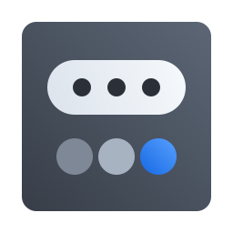
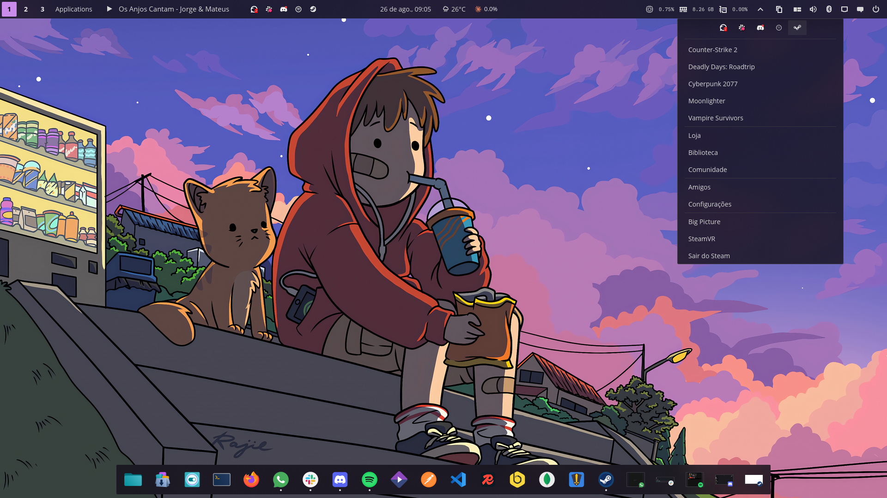

<div align="center">



# Status Hub

A StatusNotifierItem tray for the [COSMIC](https://system76.com/cosmic) desktop, gathered behind
a single panel button.

</div>

The panel shows one icon. Clicking it opens a compact popup holding the tray items, wrapping them
onto additional rows when there are many. Nothing else is added to the panel.



## Features

- Collects every StatusNotifierItem on the session bus behind one panel button.
- Renders DBusMenu menus, including submenus, checkmarks, radio groups, separators, and menu
  icons.
- Resolves icons from icon names, absolute paths, or raw pixmap bytes, with attention and
  overlay icon support.
- Forwards primary, secondary, and context activation, requesting an XDG activation token so the
  target application can raise its window.
- Removes an item as soon as its bus owner disappears, so no icon is left stranded when an
  application exits without unregistering.
- Applies a timeout and a per-item error budget to every remote call, so one unresponsive
  application cannot delay another, the popup, or the panel.
- Follows the panel's anchor, size, and theme, and wraps items onto additional rows as they are
  added.

## Installation

### Flatpak

```sh
flatpak remote-add --if-not-exists --user cosmic https://apt.pop-os.org/cosmic/cosmic.flatpakrepo
flatpak install --user cosmic io.github.marcelogomes90.cosmic-ext-applet-status-hub
```

### From source

Needs a Rust toolchain and the COSMIC development dependencies.

```sh
just build-release
just install-user      # ~/.local, no root
# or
sudo just install      # /usr
```

Then add **Status Hub** in Settings → Desktop → Panel → Applets.

## Licence

GPL-3.0-only. See [LICENSE](LICENSE).
